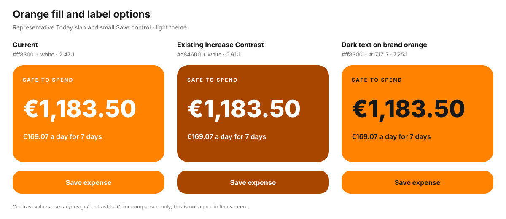

# Orange contrast review — 25 September 2026

## Finding

The default light theme pairs white with the brand orange `#ff8300` at **2.47:1**. Dark theme orange is **2.38:1**. The same pairing appears in the Today slab, the default `Button`, badges, selected calendar dates, and small labels. Of the eight selectable accents, three (sunset, coral, ocean) fall below 4.5:1 for their normal fill labels in both light and dark themes. Barbie pink is 3.27:1 in light mode and 3.14:1 in dark mode.

The app already has an Increase Contrast response to `prefers-contrast: more`. It deepens the orange fill to `#a84600` while keeping white text, reaching **5.91:1**. `tokens.test.ts` checks all three themes and all eight user accents at a 4.5:1 minimum in that mode. The pre-paint script and `useAccentColor` both account for the media query, including a saved custom accent.

| Treatment                          | Light theme ratio | What changes                                                     |
| ---------------------------------- | ----------------: | ---------------------------------------------------------------- |
| Current brand orange + white       |            2.47:1 | Exact brand fill and current appearance                          |
| Existing Increase Contrast + white |            5.91:1 | Deeper orange; keeps the white label convention                  |
| Brand orange + near-black          |            7.25:1 | Keeps the fill; changes the label convention and visual identity |

These ratios use `src/design/contrast.ts`. _Practical UI_ (pp. 79–83) and _Refactoring UI_ (pp. 162–164) both explain the WCAG 2 text contrast targets. _Practical UI_ also shows why APCA can assess white on orange differently. The current pairing is an explicit product choice in `src/design/palette.ts`; the audit does not treat it as an accidental token error.

## Proposal

Expose the **existing Increase Contrast treatment** in Settings with two choices: **Use device setting** (default) and **Always increase contrast**. This gives people access to the already tested deeper fills when their device has no accessible contrast preference or they want this app to differ from the device. Keep the current device setting response and the white-on-fill pairing.

Implementation would persist a contrast preference, apply it in the pre-paint theme script, and use it when resolving custom accents in `useAccentColor`. `src/design/tokens.ts` should remain the source for every color value; `npm run build` should regenerate the CSS and CSP hash. Add a focused test for stored preference and first-paint behavior. This proposal needs a product decision because it adds a visible Settings choice and a persistent appearance preference.

## Scope of this review

This is a token and call-site audit with a color comparison. It does not measure APCA values or test legibility with users on physical devices.
